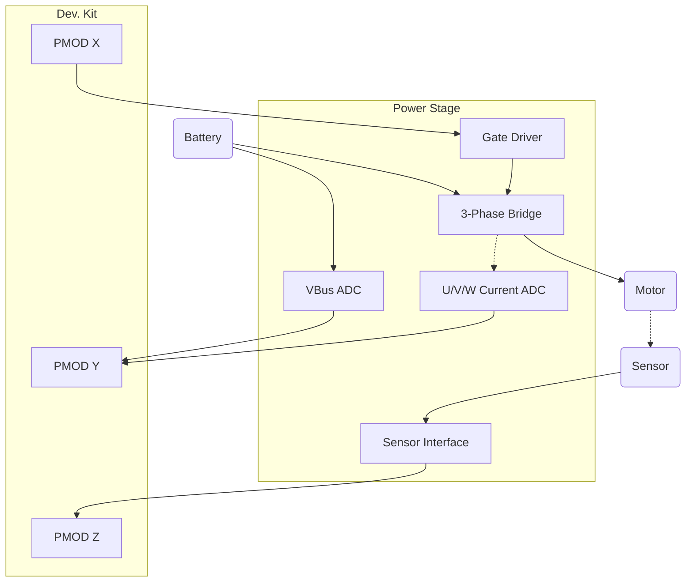

# User Requirements

## 1. Overview

The drive card should provide a power stage with high qualitiy features to drive a 3-phase motor from typical car lead or RC style lithium batteries for educational and development purposes. The PCB shall provide the required frontend to an external controller at a common logic level.
The design shall be cost optimized where possible without compromising functionality under lab conditions. The PCB shall interface directly with common low to mid priced FPGA development boards and should be easily adaptible to interface with other boards. The PCB shall provide sufficent power supply to the connected controller for standalone, mobile operation.

- Drive **500W** PMSM and other synchronous **motors** from 12V–48V (lead-acid or lithium)
- Based on **TMC6200 gate driver**
- All phase current & bus voltage **sensing** in high resolution (>12-Bit, $f_s >= 2f_{PWM}$)
- Multiple **encoder** support (ABZ, BISS-C/SSI, optionally SPI)
- Interfaces with **Arty A7**, **Zybo Z7**, or optionally **Vidor 4000**

---
## 2. Power Stage

The design shall be dimensioned for high currents to continuously deliver up to 500W from down to 12V upt to 60V. PWM frequencies shall be supported at least from 4 kHz up to 25kHz. 4 quadrant operation shall be possible with battery, an onboard or external brake chopper is optional.

- **Input Voltage**: 12V–48V (up to 60V abs max)
- **Output**: 35A RMS, 50A peak
- **External MOSFETs** (N-channel, low R_DS(on))
- **Bulk capacitors** for ripple suppression
- Reverse polarity & overvoltage protection

---
## 3. Gate Driver: TMC6200

The TCM6200 shall be chosen due to its specs matching or exceeding the requiremnts of the power stage and support for current sensing.

- 3-phase gate driver with:
  - 3x or 6x PWM support
  - SPI config & diagnostics
  - Shoot-through & UV/OV protection
  - Charge pump for 100% duty cycle
- Interfaces directly with external MOSFETs
- Supports external current sensing

---
## 4. Sensing

The design shall enable PWM synchronous sampling of all three phase currents and the DC bus voltage.

- **Current**: 3-phase sensing (inline or low-side), routed to FPGA
- **Voltage**: Phase voltages + DC bus
- **Temperature**: Optional NTC or digital sensor input for MOSFET temp

---
## 5. Encoder Interface

The design shall provide at least one commonly used sensor interface.

- Supports:
  - **BiSS-C**, **SSI**
  - **ABZ incremental**
  - **SPI encoders** (e.g., AS5047)
- 12V/5V/3.3V switchable encoder supply
- Up to 12V tolerant inputs
- ESD protection & differential receivers

---
## 6. FPGA / Logic Interface

The design shall mechanically fit directly to Digilent Arty A7 or Zybo Z7 development board.

- **PMOD-compatible** I/O headers (3.3V)
- FPGA interfaces:
  - PWM (3 or 6)
  - SPI (TMC6200, encoders)
  - Encoder signals (ABZ, BiSS-C, etc.)
- Compatible with:
  - **Arty A7**
  - **Zybo Z7**
  - **Intel Vidor 4000** (via adapter)

---
## 7. Mechanical

- PCB Size: ≤ 150mm x 100mm
- Mounting holes for heatsink/enclosure
- Connectors:
  - XT60 or screw terminals (power)
  - Screw terminals for motor phases
  - Pin headers for logic & encoders

---
## 8. Deliverables
- KiCad schematic + PCB layout
- BOM

---
## Example System Overview

